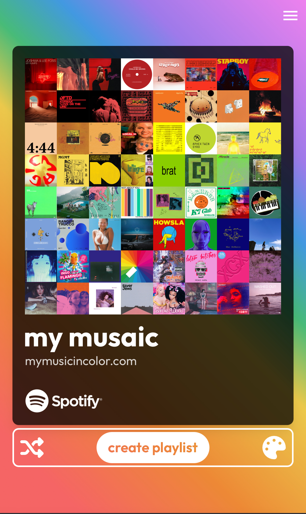
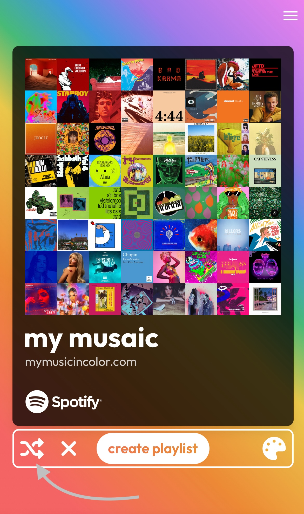
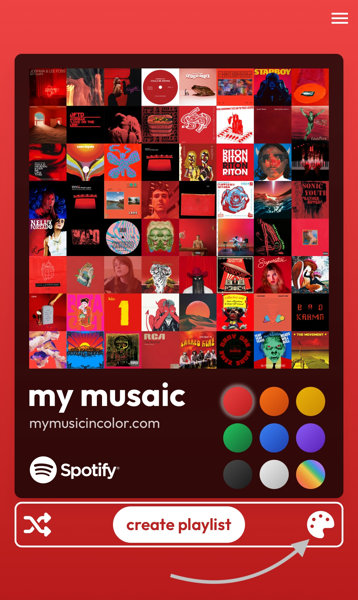
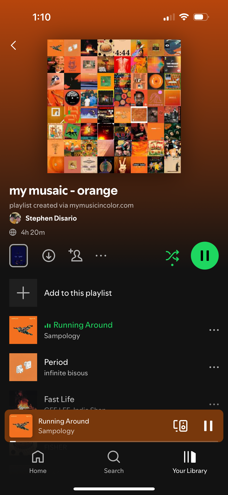
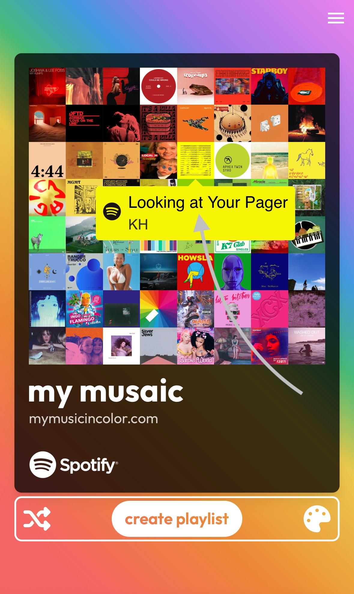
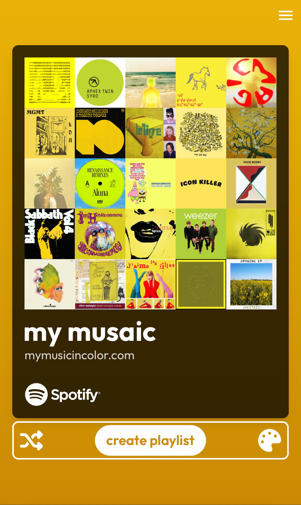
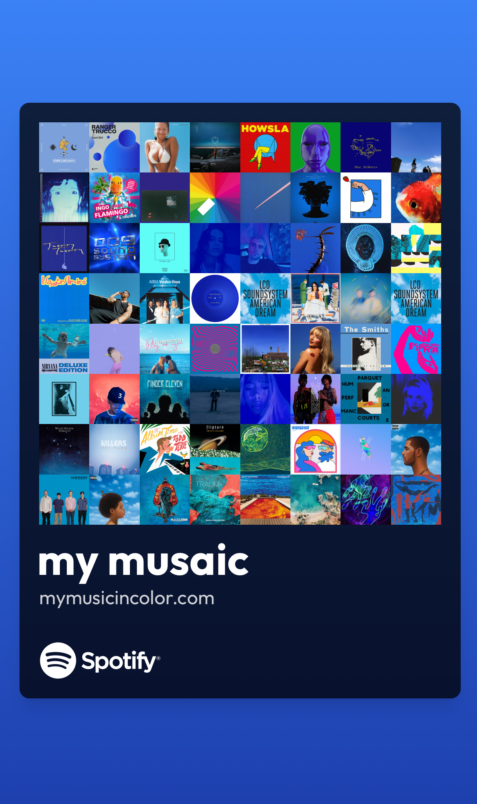

# MyMusicInColor - Explore your colorful musaics 🎶🌈

Welcome to **MyMusicInColor**, an app that groups your top tracks from the past year by color and creates musaics. This preview showcases the core features and visual elements of the app while awaiting Spotify's production approval. Feel free to explore the images and demo video below to get a sense of the app's functionality and design.

> **Note**: Since the app is still in development mode, it is not currently accessible to the public. Please stay tuned for updates!

## 🌟 App Features Overview

### 1. **Rainbow Musaic** - The Landing Page 🌈

After logging into the app, users are greeted with the **Rainbow Musaic** (arguably the best musaic). This is where your top tracks from each color group are compiled into an 8x8 musaic. Below the musaic you will find the **Control Bar** used for shuffling, switching colors, and playlist creation.

---

### 2. **Shuffle Button** - Keep It Fresh 🔀

The **Shuffle** button allows you to mix it up! shuffle any color group to see a new random set of tracks. To reset to the default top tracks, click the X icon.

---

### 3. **Color Picker** - Customize Your Musaic 🎨

Use the **Color Picker** to choose between nine musaic color options.

---

### 4. **Playlist Creation** - Listen to Your Musaic 🎶🎧

When you are happy with a Musaic you have created, you can save it as a custom playlist on Spotify. The playlist's image is a snapshot of the Musaic itself.

---

### 5. **Album Art Tooltip** - Track Details 🎵

Click on any album art to view more information in a **Album Art Tooltip**. This feature displays the song's title and artist, linking directly to Spotify for easy access.

---

### 6. **Automatic Image Resizing** 🖼️

**Automatic Image Resizing** allows the Musaic to adapt when there are fewer songs in a color group. The default musaic is 8x8 but if a color group has less than 64 songs, it will resize to the next biggest perfect square.

---

### 7. **Hide Icons** - Clean View of the Musaic 🧹

Sometimes, you may want to enjoy the **Musaic** without any distractions. The **Hide Icons** feature removes all icons from the screen, and can be enabled by clicking anywhere outside of the musaic and control bar.

---

## 🔗 Links

- [GitHub Repository](https://github.com/stephendisario/My-Music-In-Color)
- [MyMusicInColor Website](https://mymusicincolor.com) - *Note: The app is currently in development mode and not accessible to the public.*

---

## 📝 Conclusion

Thank you for checking out **MyMusicInColor**! Stay tuned for updates and the official approval from Spotify.

---

**Built by Stephen**
